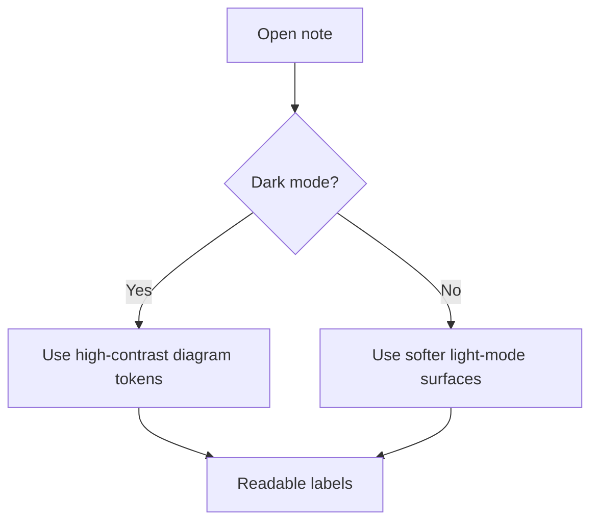
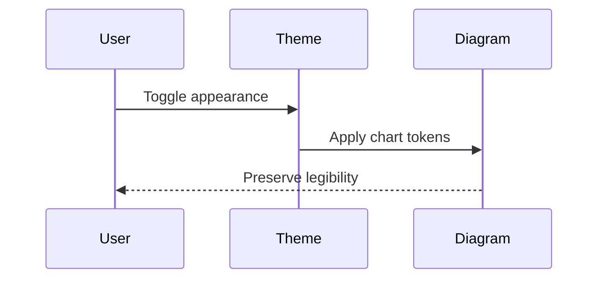
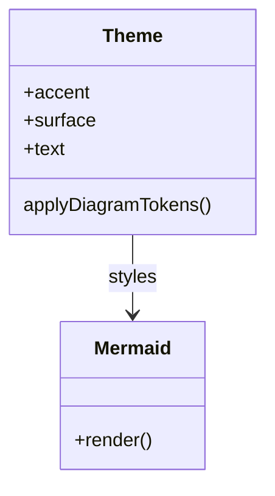
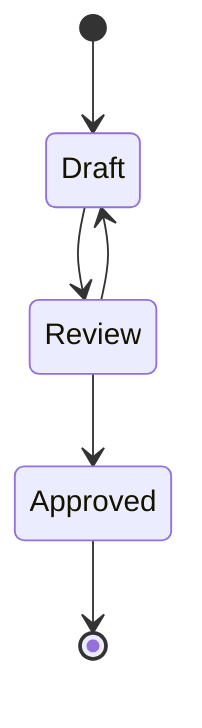
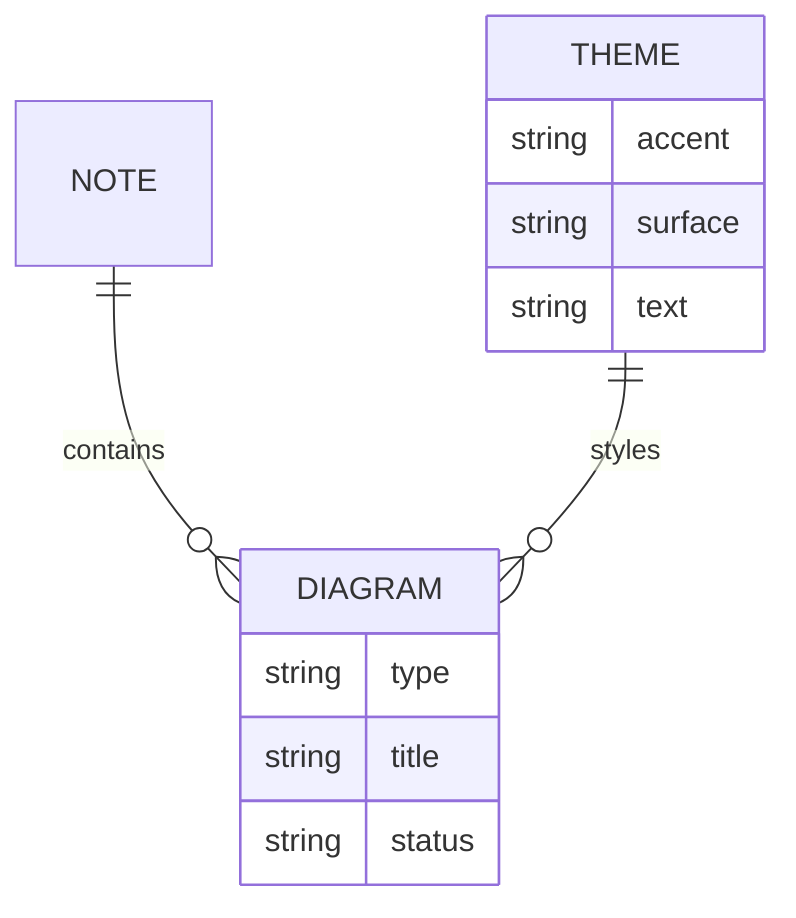
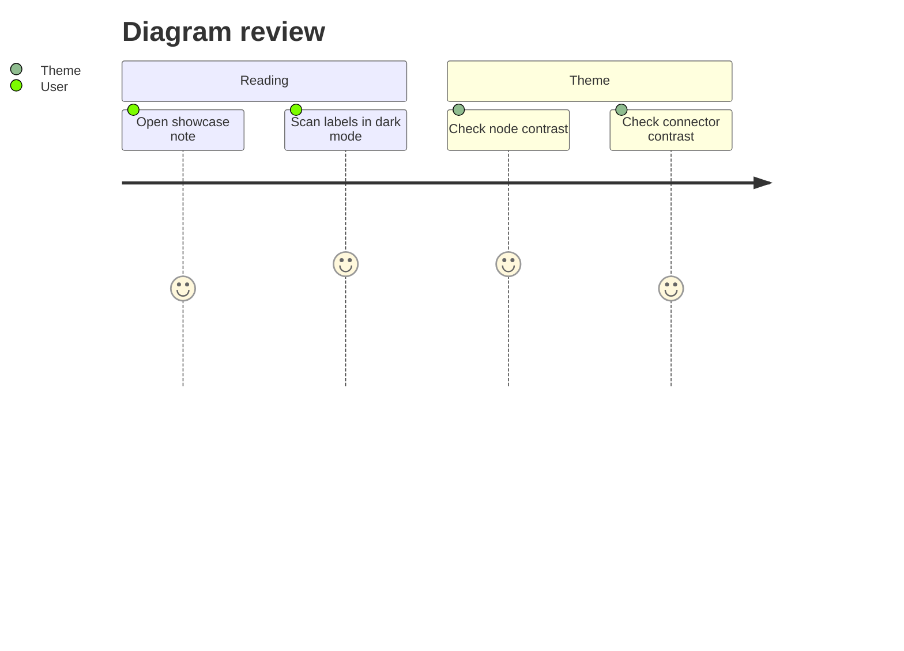
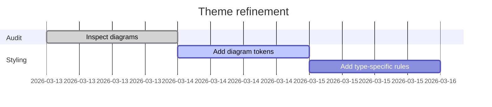
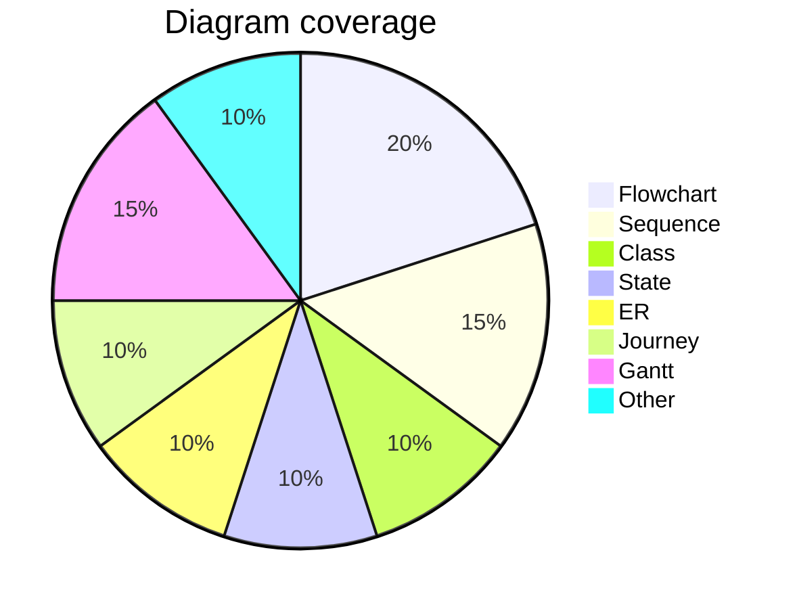
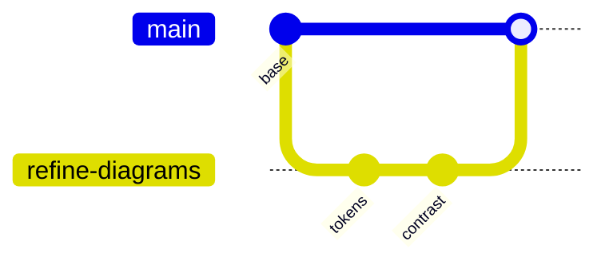

# Diagram Showcase

This page checks Mermaid readability in both light mode and dark mode. The diagrams should stay aligned with the warm editorial feel of Sable Ledger while remaining obviously legible.

## Flowchart

## Sequence

## Class

## State

## ER

## Journey

## Gantt

## Pie

## Git Graph

